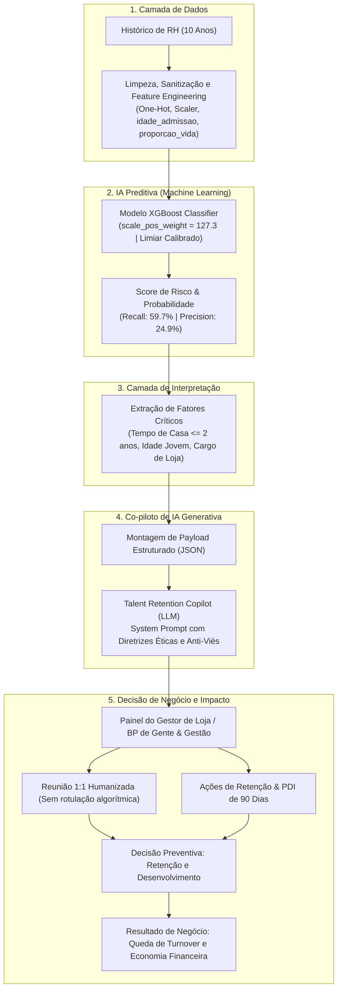

# 🤖 Desafio Integrador: AI & Data-Driven Challenge
## 🟥 Squad 4 — Gestão de Pessoas & People Analytics
### Projeto: Talent Retention AI — Plataforma Inteligente de Prevenção de Turnover

---

### 👥 Ficha Técnica do Squad 4
* **Integrantes**: Gabriel Maia, João Lucca, Kevin Mascarenhas, Marina Gonçalves e Samuel Paulo
* **Disciplina**: Data Science & AI Integrator
* **Papel**: Consultoria Especializada em Inteligência Artificial aplicada a Recursos Humanos
* **Dataset**: `MFG10YearTerminationData.csv` (Histórico de 10 anos de colaboradores — 2006 a 2015)
* **Notebook Principal**: [`People_Analytics_Entrega_Geral.ipynb`](./People_Analytics_Entrega_Geral.ipynb)

---

## 📑 Sumário Executivo dos Entregáveis

```
Dados de RH ──> Pré-processamento ──> XGBoost (Preditiva) ──> Score de Risco ──> Co-piloto GenAI ──> Parecer 1:1 + PDI ──> Gestor Atua Preventivamente
```

A solução **Talent Retention AI** integra Machine Learning clássico supervisionado (XGBoost calibrado) a um Co-piloto Generativo especialista em People Analytics. O objetivo central é transformar uma gestão de desligamentos tradicionalmente **reativa** (que só age após o colaborador pedir demissão) em um processo **preventivo, humanizado e estratégico**, gerando economia financeira e preservando o capital intelectual da empresa.

---

## 1. Problema de Negócio

### 1.1 Qual problema está sendo resolvido?
O alto índice de **turnover voluntário** (pedidos espontâneos de demissão), especialmente concentrado na operação de lojas físicas (frente de caixa e atendimento ao cliente), em colaboradores jovens e nos primeiros dois anos de empresa.

### 1.2 Quem são os usuários da solução?
1. **Business Partners (BPs) de Gente & Gestão (RH):** Utilizam a visão tática e analítica para acompanhar os indicadores de risco por loja, departamento e cargo, desenhando políticas corporativas de retenção.
2. **Gestores de Loja e Supervisores de Atendimento:** Liderança operacional que recebe os alertas preventivos, o roteiro estruturado para reuniões 1:1 e os Planos de Desenvolvimento Individual (PDI) customizados pelo Co-piloto.

### 1.3 Qual decisão precisa ser melhorada?
* **Cenário Atual (Decisão Reativa):** O gestor descobre a insatisfação do colaborador quando ele entrega o aviso prévio. A empresa gasta com rescisão e corre para abrir uma vaga emergencial no mercado.
* **Cenário Otimizado (Decisão Preventiva):** O gestor identifica com meses de antecedência os sinais de saturação e risco de saída, realizando conversas de alinhamento de carreira e ajustando tarefas antes que o colaborador decida buscar outro emprego.

### 1.4 Qual impacto o problema gera para a organização?
* **Custos Diretos:** Gastos com rescisão, publicação de vagas, consultorias de seleção, exames admissionais e integrações.
* **Custos Indiretos:** Queda na qualidade do atendimento de loja, aumento de filas e erros de caixa devido a funcionários inexperientes, sobrecarga dos colegas remanescentes e perda de know-how interno.

---

## 2. Dados

### 2.1 Dados necessários e fontes
* **Histórico Cadastral e Funcional:** Idade, data de nascimento, data de admissão, tempo de empresa, cargo (`job_title`), departamento (`department_name`), unidade de negócio (`BUSINESS_UNIT`) e identificação da loja (`store_name`).
* **Fontes Recomendadas em Produção:** Sistemas de HRIS (ex: Workday, SAP SuccessFactors), sistemas de ponto eletrônico e ERP de folha de pagamento.

### 2.2 Variáveis utilizadas pelo modelo
* **Numéricas e Temporais:** `age` (idade), `length_of_service` (tempo de serviço), `idade_admissao` (idade calculada no momento da contratação), `faixa_tempo_casa` (agrupamento temporal de maturidade na função), `proporcao_vida_na_empresa` (fração da vida adulta dedicada à empresa).
* **Categóricas Tratadas via One-Hot Encoding:** `BUSINESS_UNIT` (HEADOFFICE vs STORES), `job_title` (cargos operacionais e de gestão), `department_name` (departamentos) e `gender_short`.

### 2.3 Variável-Alvo (Target)
* **`desligamento_voluntario` (Binária: 0 ou 1):** Definida como `1` quando o colaborador estava com status `TERMINATED` e o motivo do desligamento (`termreason_desc`) foi registrado como `Resignation` (pedido voluntário de demissão) naquele ano fiscal. Aposentadorias (`Retirement`) e demissões sem justa causa em massa (`Layoff`) foram excluídas do target para manter o foco exclusivo no risco de retenção voluntária.

### 2.4 Qualidade dos dados e tratamentos realizados
* **Datas disfarçadas de nulos:** A data fictícia `1/1/1900` utilizada no sistema para colaboradores ativos foi tratada para evitar distorções de cálculo.
* **Erros de digitação (Sanitização):** Correção de inconsistências no cadastro, como a grafia `'Resignaton'` corrigida para `'Resignation'`.
* **Duplicatas parciais:** Tratamento de colaboradores que possuíam registros duplicados no mesmo ano fiscal devido a transferências de loja.
* **Forte Desbalanceamento de Classes:** Na base de 10 anos, apenas ~1% a 2% das linhas correspondem a pedidos de demissão em um ano específico, exigindo modelagem balanceada.

---

## 3. Modelo de IA Preditiva

### 3.1 Tipo de problema de Machine Learning
Classificação binária supervisionada com classes fortemente desbalanceadas.

### 3.2 Algoritmo escolhido e justificativa
* **Algoritmo Selecionado:** **XGBoost Classifier** (comparado contra Decision Tree e Random Forest).
* **Justificativa:** O XGBoost apresentou o melhor compromisso entre capacidade de aprendizado (*gradient boosting*), controle de overfitting e facilidade de lidar com desbalanceamento severo através do parâmetro nativo `scale_pos_weight`.

### 3.3 Processo de treinamento e validação
* **Estratégia Anti-Vazamento:** Divisão entre Treino (80%) e Teste (20%) utilizando **`StratifiedGroupKFold`** agrupado pelo identificador do colaborador (`EmployeeID`). Isso garante que o histórico de um mesmo profissional nunca esteja simultaneamente no treino e no teste.
* **Tratamento de Desbalanceamento:** Utilização de `scale_pos_weight = 127.3` para penalizar com muito mais severidade os falsos negativos (deixar de prever uma pessoa que de fato pediu demissão).
* **Calibração de Limiar (Threshold):** Em vez de utilizar o corte arbitrário de 0.50, o limiar de decisão foi ajustado e calibrado para maximizar a área sob a curva de Precisão-Recall (**PR-AUC**), equilibrando sensibilidade e alarmes falsos.

### 3.4 Métricas técnicas obtidas na base de teste
* **Recall (Sensibilidade):** **~59.7%** (o modelo identifica quase 6 em cada 10 colaboradores que de fato pedirão demissão).
* **Precision:** **~24.9%** (1 em cada 4 pessoas alertadas pelo modelo pedirá demissão; os outros 3 são colaboradores em fase de adaptação que se beneficiam igualmente da mentoria).
* **PR-AUC:** **0.18** a **0.19** (significativamente superior à linha de base aleatória de 0.015).
* **Por que a acurácia foi descartada:** Um modelo ingênuo (*Dummy Classifier*) que prevê que ninguém vai pedir demissão atinge **99.2% de acurácia**, mas é 100% inútil para o negócio.

### 3.5 Limitações do modelo
* A base é estática e termina em 2015.
* Ausência de variáveis dinâmicas de RH: remuneração atualizada, horas extras acumuladas, avaliações de desempenho 9-Box e pesquisa de clima.

---

## 4. Agente / Co-piloto de IA Generativa

### 4.1 Papel do Co-piloto de IA Generativa
O Co-piloto atua como um **Consultor Estratégico de People Analytics**. Ele traduz probabilidades frias e importâncias de variáveis em **estratégias práticas e humanizadas de gestão de pessoas**, municiando os líderes com planos de desenvolvimento e roteiros de diálogo.

### 4.2 Informações enviadas para o modelo generativo (Payload)
O Co-piloto recebe um objeto estruturado em JSON contendo:
* Perfil profissional do colaborador (Cargo, Departamento, Unidade de Loja, Idade, Idade de Admissão, Tempo de Empresa);
* Probabilidade de turnover predita pelo XGBoost (ex: 82%);
* Principais fatores estatísticos identificados pelo modelo (ex: cargo de frente de caixa, menos de 2 anos de casa, faixa etária jovem).

### 4.3 System Prompt com Diretrizes Éticas e de Negócio

```text
Você é o Talent Retention Copilot, consultor sênior em People Analytics e Gestão de Pessoas.
Sua função é transformar predições estatísticas de turnover em planos práticos, humanizados e acionáveis para líderes.

DIRETRIZES ÉTICAS E DE NEGÓCIO:
1. NUNCA sugira demitir, isolar ou retaliar o colaborador. A abordagem deve ser 100% preventiva e de acolhimento.
2. NUNCA revele na abordagem que o colaborador foi apontado por algoritmo preditivo. Trate como mentoria de rotina.
3. Evite qualquer viés de gênero ou idade.
4. Responda ESTRITAMENTE nas 4 seções exigidas:
   - SEÇÃO 1: Síntese dos Fatores de Risco
   - SEÇÃO 2: Estratégia de Abordagem do Gestor (Roteiro 1:1)
   - SEÇÃO 3: Ações Práticas de Retenção
   - SEÇÃO 4: Sugestão de PDI (Plano de Desenvolvimento Individual - 90 Dias)
```

### 4.4 Resultado Esperado (Exemplo de Parecer Gerado)

```text
================================================================================
                    PARECER DO TALENT RETENTION COPILOT
================================================================================
COLABORADOR: Cashier | Customer Service | Loja 20 - Vancouver
STATUS DO MODELO: ALTO RISCO (82.0% de probabilidade de saída)

1. SÍNTESE DOS FATORES ASSOCIADOS AO RISCO IDENTIFICADO
O colaborador foi classificado com score de atenção prioritária decorrente de:
- Período crítico de adaptação (tempo de empresa: 2 anos);
- Faixa etária jovem (22 anos, admitido aos 20 anos);
- Cargo de atendimento operacional na ponta do varejo (Cashier);
- Alocação em loja física (Loja 20 - Vancouver).
Diagnóstico: Colaboradores nessa posição enfrentam fadiga pela repetitividade do atendimento
de caixa e costumam buscar posições externas entre 12 e 24 meses se não visualizarem um
plano de carreira ou novos desafios internos.

2. ESTRATÉGIA DE ABORDAGEM DO GESTOR (ROTEIRO DE CONVERSA 1:1)
* Objetivo: Criar conexão, escutar desafios diários e traçar horizonte de crescimento.
* Tom: Acolhedor, empático e de suporte.
* Abertura: "Oi! Reservei um tempo hoje para conversarmos sobre como você tem se sentido
  aqui na equipe e quais são os seus objetivos de carreira para os próximos meses."
* Perguntas-chave:
  - "O que tem sido mais estimulante e o que tem sido mais desgastante na sua rotina na loja?"
  - "Qual outra área ou responsabilidade na loja desperta seu interesse?"
  - "O que nós podemos fazer juntos para apoiar o seu desenvolvimento este ano?"
* Fechamento: "Quero que saiba que valorizamos muito seu trabalho aqui e vamos construir
  um plano para você evoluir na rede."

3. SUGESTÕES DE AÇÕES IMEDIATAS DE RETENÇÃO
* Revezamento de Tarefas: Alternar a escala de caixa com atividades de conferência de
  mercadorias no estoque ou apoio à supervisão para amenizar o cansaço repetitivo.
* Mentoria Interna: Designar um líder de turno experiente como padrinho/mentor.
* Reconhecimento: Elogio formal no mural da loja pelo índice de satisfação de clientes.

4. SUGESTÕES DE PDI (PLANO DE DESENVOLVIMENTO INDIVIDUAL - 90 DIAS)
* MÊS 1 (Engajamento): Inscrição na trilha corporativa "Gestão de Atendimento e Varejo".
  Reuniões quinzenais de alinhamento com o gestor.
* MÊS 2 (Capacitação Prática): 4 horas semanais de Job Shadowing com o Supervisor de Loja.
  Treinamento em fechamento de caixa e rotinas administrativas.
* MÊS 3 (Preparação Sucessória): Apresentação de proposta de melhoria de fluxo de atendimento.
  Inclusão formal no Banco de Talentos para futuras vagas de Subgerente de Loja.
================================================================================
```

### 4.5 Como o usuário interage com o Co-piloto
1. **Notificação Automática:** O BP de RH e o Gestor recebem mensalmente uma lista priorizada de colaboradores em período de atenção.
2. **Painel Interativo:** O gestor clica no perfil do colaborador e visualiza o parecer completo gerado pelo Co-piloto.
3. **Registro da Ação:** Após a reunião 1:1, o gestor marca o status da conversa e registra os compromissos acordados no PDI.

---

## 5. Fluxo Visual da Solução Integrada



---

## 6. Métricas

### 6.1 Métricas Técnicas do Modelo
* **Recall (~59.7%):** Assegura que a grande maioria dos potenciais desligamentos seja capturada pelo radar preventivo.
* **Precision (~24.9%):** Controla os alarmes falsos, garantindo que 1 em cada 4 indicações seja um caso crítico real.
* **PR-AUC (0.19):** Métrica de escolha para avaliação em cenários com desbalanceamento severo de classes.

### 6.2 Métricas de Negócio e Indicadores de Sucesso
* **Redução na Taxa de Turnover Voluntário:** Meta de redução relativa de **15% a 25%** nos primeiros 12 meses nas lojas que implementarem o programa.
* **Custo de Reposição Evitado (*Cost-per-Hire*):** Substituir um colaborador de loja custa em média 6 meses de remuneração (~R\$ 15.000). A retenção de 30 colaboradores por ano gera uma economia direta de **R\$ 450.000**.
* **Taxa de Aderência ao PDI:** Meta de **no mínimo 80%** de colaboradores alertados iniciando a trilha de capacitação dentro de 30 dias.
* **Taxa de Eficácia da Abordagem 1:1:** % de colaboradores que permaneceram ativos 6 meses após a reunião de alinhamento com a liderança.

---

## 7. Matriz de Riscos, Limitações e Governança Ética

| Eixo de Risco | Descrição do Risco | Estratégia de Mitigação Adotada |
| :--- | :--- | :--- |
| **1. Qualidade dos Dados** | Ausência de variáveis de sentimento, remuneração, horas extras e avaliação de desempenho na base histórica. | Projeto piloto prevê integração com o ERP de folha e HRIS; recomendação de enriquecimento contínuo da base. |
| **2. Viés Algorítmico (*Ageism*)** | O modelo pode rotular jovens desproporcionalmente como instáveis devido ao peso de `age`. | Auditorias semestrais de equidade (*disparate impact*); proibição absoluta de usar o modelo para descartar candidatos jovens. |
| **3. Privacidade (LGPD)** | Vazamento de scores de risco e anotações pessoais de colaboradores. | Acesso estrito por controle de perfil (RBAC) restrito ao BP e gestor direto imediato; anonimização em relatórios executivos. |
| **4. Segurança da Informação** | Vazamento de dados internos de headcount para modelos generativos públicos. | Uso obrigatório de APIs corporativas com política de retenção zero (*Zero-Data Retention Policy*) e criptografia de ponta a ponta. |
| **5. Alucinações da IA** | O LLM inventar motivos não embasados nos dados (ex: assumir atrito salarial inexistente). | *Grounding* estrito no payload JSON fornecido e parametrização com baixa temperatura para geração factual. |
| **6. Interpretação Incorreta** | Gestor interpretar risco de 70% como demissão consumada e retaliar o funcionário. | Treinamento obrigatório da liderança reforçando que o alerta é convite ao acolhimento e mentoria, nunca uma punição. |
| **7. Dependência Excessiva** | Líderes deixarem de ouvir a equipe no dia a dia e só atuarem quando o algoritmo disparar alerta. | Princípio inegociável de **Human-in-the-Loop**: a IA é um copiloto consultivo, e a escuta ativa da liderança é insubstituível. |

---

## 8. Resposta ao Desafio Adicional

> **"Se esta solução fosse colocada em produção amanhã, qual seria o maior risco de utilizá-la para apoiar decisões reais?"**

### Resposta Oficial do Squad 4:
O maior risco de implementar a solução em produção amanhã seria a ocorrência da **profecia auto-realizável provocada pelo viés punitivo da liderança, combinada à discriminação por idade (*ageism*)**.

1. **Aspecto Técnico:** Devido ao forte desbalanceamento da base, o modelo calibrado possui uma Precisão de ~25% para sustentar um Recall de ~60%. Isso significa que, a cada 4 colaboradores sinalizados como alto risco, 3 **não** pediriam demissão naquele momento.
2. **Aspecto de Negócio:** Se um gestor de loja receber a lista de risco e adotar uma postura de desconfiança ou retaliação — deixando de incluir o colaborador em treinamentos, negando promoções ou transferências sob a justificativa de que 'ele já vai sair mesmo' —, a própria atitude de isolamento da liderança empurrará o colaborador para fora da empresa, criando o turnover que o modelo apenas previu.
3. **Aspecto Ético:** Como o modelo atribui grande peso a colaboradores jovens com pouco tempo de casa, decisões precipitadas puniriam de forma discriminatória a juventude da empresa.

**Diretriz de Mitigação Adotada:** A plataforma Talent Retention AI foi desenhada sob a premissa inegociável de **Human-in-the-Loop**. A ferramenta é um instrumento de **cuidado, mentoria e desenvolvimento de carreira (PDI)**. Seu uso é expressamente proibido para justificar demissões, cortes de oportunidades ou sanções disciplinares.

---

## 9. Roteiro para a Apresentação Final (Pitch do Squad 4)

| Pergunta do Pitch | Resposta Objetiva do Squad 4 |
| :--- | :--- |
| **1. Qual problema estamos resolvendo?** | O alto custo e a perda de talentos causados pelo turnover voluntário reativo em lojas físicas da rede varejista. |
| **2. Quais dados utilizamos?** | Histórico de 10 anos de colaboradores (`MFG10YearTerminationData.csv`), tratando anomalias de datas e focando em pedidos voluntários de demissão. |
| **3. O que o modelo preditivo consegue prever?** | A probabilidade de um colaborador pedir demissão no ano corrente, com base em idade, tempo de casa e cargo operacional. |
| **4. Como avaliamos se o modelo é bom?** | Através de Recall (~60%) e PR-AUC (0.19) com limiar calibrado no XGBoost, superando o modelo ingênuo que acerta 99% mas é inútil. |
| **5. Como a IA Generativa utiliza essa previsão?** | Ela recebe o score e o perfil do colaborador e gera um parecer humanizado: síntese de risco, roteiro de conversa 1:1, ações de retenção e PDI de 90 dias. |
| **6. Que decisão ou ação a solução recomenda?** | Recomenda que o gestor realize uma reunião 1:1 empática de mentoria e inicie um plano de capacitação e alternância de tarefas antes do colaborador pedir demissão. |
| **7. Qual valor essa solução gera para o negócio?** | Redução de até 25% no turnover voluntário de lojas, gerando uma economia estimada de até R\$ 450 mil/ano em custos de reposição e preservando o know-how de atendimento. |
| **8. Quais são os riscos e limitações?** | O risco da profecia auto-realizável e discriminação por idade, mitigado pela proibição de uso punitivo e foco estrito em acolhimento e desenvolvimento (*Human-in-the-Loop*). |
