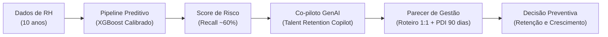

# 🤖 Talent Retention AI — Plataforma Inteligente de Prevenção de Turnover
> **Desafio Integrador: AI & Data-Driven Challenge**  
> **🟥 Squad 4 — Gestão de Pessoas & People Analytics**

[](https://www.python.org/)
[](https://opensource.org/licenses/MIT)
[](https://colab.research.google.com/drive/1mLxP7qOZuvof1RBmgNtbnAAAabLM1If6?usp=sharing)

---

## 👥 Integrantes do Squad 4
* **Gabriel Maia**
* **João Lucca**
* **Kevin Mascarenhas**
* **Marina Gonçalves**
* **Samuel Paulo**

---

## 📌 Visão Geral do Projeto
A plataforma **Talent Retention AI** integra **Machine Learning Preditivo (XGBoost Otimizado)** e um **Co-piloto de IA Generativa** especialista em People Analytics para transformar o combate ao turnover voluntário no varejo:

$$\text{Dados de RH} \longrightarrow \text{XGBoost Preditivo} \longrightarrow \text{Score de Risco} \longrightarrow \text{Co-piloto GenAI} \longrightarrow \text{Roteiro 1:1 + PDI} \longrightarrow \text{Ação Humanizada}$$

Ao invés de uma abordagem tradicional **reativa** (agir apenas quando o colaborador entrega o pedido de demissão), a solução capacita Business Partners de RH e gestores de loja a intervirem **preventivamente**, oferecendo mentoria, alternância de rotina e planos de carreira individualizados de 90 dias.

---

## 🚀 Estrutura de Arquivos

| Arquivo | Descrição |
| :--- | :--- |
| [`People_Analytics_Entrega_Geral.ipynb`](./People_Analytics_Entrega_Geral.ipynb) | **Notebook principal completo** contendo saneamento de dados, EDA profunda, engenharia de atributos, modelagem comparativa (Árvores, Random Forest e XGBoost com limiar PR-AUC calibrado) e o **Bloco 9** com o pipeline do Co-piloto Generativo integrado. |
| [`ENTREGA_DESAFIO_INTEGRADOR_SQUAD4.md`](./ENTREGA_DESAFIO_INTEGRADOR_SQUAD4.md) | **Documento executivo oficial da entrega** contendo todos os 7 entregáveis do edital da professora, a matriz ética e de riscos, a resposta ao Desafio Adicional e o roteiro do pitch de apresentação. |
| [`MFG10YearTerminationData.csv`](./MFG10YearTerminationData.csv) | Base histórica de 10 anos de colaboradores do varejo utilizada para modelagem. |
| [`requirements.txt`](./requirements.txt) | Dependências Python para execução do projeto. |
| [`legado/`](./legado/) | Diretório contendo versões anteriores e estudos intermediários das etapas do curso. |

---

## 📊 Arquitetura da Solução



---

## ⚙️ Como Executar

### Opção 1: Google Colab (Recomendado)
Acesse diretamente o notebook no ambiente Google Colab através do link:
👉 **[Executar no Google Colab](https://colab.research.google.com/drive/1mLxP7qOZuvof1RBmgNtbnAAAabLM1If6?usp=sharing)**

### Opção 2: Execução Local
1. Clone o repositório e acerte a branch:
   ```bash
   git clone <URL_DO_REPOSITORIO>
   git checkout feat/desafio-integrador-squad4
   ```
2. Crie e ative o ambiente virtual:
   ```bash
   python -m venv venv
   # No Windows:
   venv\Scripts\activate
   # No Linux/Mac:
   source venv/bin/activate
   ```
3. Instale as dependências:
   ```bash
   pip install -r requirements.txt
   ```
4. Abra o Jupyter Notebook ou JupyterLab:
   ```bash
   jupyter lab People_Analytics_Entrega_Geral.ipynb
   ```
